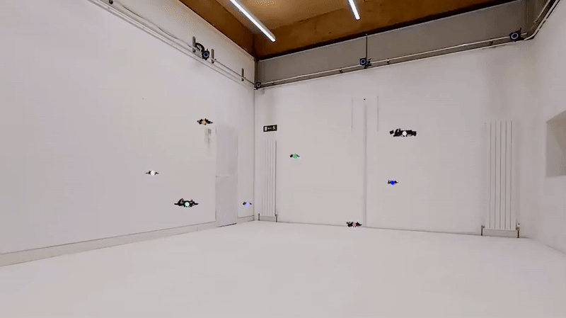
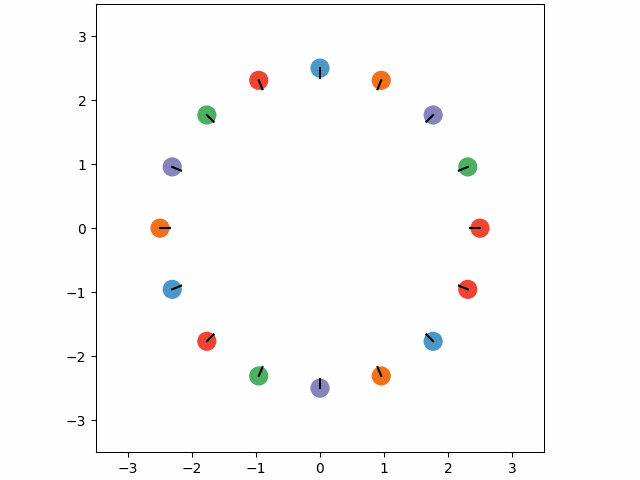

<div align="center">
  <h1>D4orm: Multi-Robot Trajectories with <br>Dynamics-aware Diffusion Denoised Deformations</h2>
  <strong>IROS 2025</strong>
  <br>
    <a href="https://github.com/yuhaozhang7" target="_blank">Yuhao Zhang</a><sup>1</sup>,
    <a href="https://kei18.github.io/" target="_blank">Keisuke Okumura</a><sup>1,2</sup>,
    <a href="https://proroklab.org/team/" target="_blank">Heedo Woo</a><sup>1</sup>,
    <a href="https://www.cl.cam.ac.uk/~as3233/" target="_blank">Ajay Shankar</a><sup>1</sup>,
    <a href="https://www.cst.cam.ac.uk/people/asp45" target="_blank">Amanda Prorok</a><sup>1</sup>
  <p>
    <h45>
      <sup>1</sup>Prorok Lab, University of Cambridge &nbsp;&nbsp;
      <sup>2</sup>AIST Japan &nbsp;&nbsp;
    </h5>
  </p>

  [](https://www.youtube.com/watch?v=WuFuecpZQSY)
  [](https://arxiv.org/abs/2503.12204)

</div>

<p align="center">
  
</p>


This repository includes code for **D4orm**, based on the [model-based diffusion](https://github.com/LeCAR-Lab/model-based-diffusion).

**D4orm** is an optimization framework for generating kinodynamically feasible and collision-free multi-robot trajectories that exploits an incremental denoising scheme in diffusion models.


## Installation

To install the required packages, run the following command:

```bash
pip install -e .
```

## Run D4orm

To run multi-robot trajectory planning with D4orm, use the following command:

```bash
python d4orm/planners/multi_planner.py
```

### Command Line Arguments

| Argument&nbsp;&nbsp;&nbsp;&nbsp;&nbsp;&nbsp;&nbsp;&nbsp;&nbsp;            | Default       | Description                                                                 |
|---------------------|---------------|-----------------------------------------------------------------------------|
| `--env_name`        | `multi2dholo`     | Specifies the environment, including `multi2d` (Differential Drive), `multi2dholo` (2D Holonomic), `multi3dholo` (3D Holonomic).  |
| `--Nagent`          | `8`           | Number of agents.  |
| `--Ndiffuse`        | `100`         | Number of diffusion/denoising steps in one single denoising optimization process.  |
| `--Niteration`      | `30`          | Number of maximum iterations.  |
| `--Nsample`         | `2048`        | Number of samples used in each denoising step.  |
| `--Hsample`         | `100`         | Time horizon (number of timesteps) for the planned trajectories.  |
| `--dt_factor`       | `1`           | Time step scaling factor applied to `dt=0.1`.  |
| `--print_info`      | *(flag)*      | Flag to print detailed runtime information.  |
| `--save_images`     | *(flag)*      | Flag to save visualization images of planned trajectories.  |

Modify the arguments to choose a different configuration. Some results will look like this:

|       |        |
|:---------------------------------------:|:---------------------------------------------:|
|           Differential Drive            |                 2D Holonomic                  |

## Run Baseline Methods

To run baseline methods, use the following command:
```bash
python d4orm/planners/path_integral.py
```

### Command Line Arguments

| Argument&nbsp;&nbsp;&nbsp;&nbsp;&nbsp;&nbsp;&nbsp;&nbsp;&nbsp;            | Default       | Description                                                                 |
|---------------------|---------------|-----------------------------------------------------------------------------|
| `--env_name`        | `multi2dholo`     | Specifies the environment, including `multi2d` (Differential Drive), `multi2dholo` (2D Holonomic), `multi3dholo` (3D Holonomic).  |
| `--method`        | `mppi`     | Specifies the method, including `mppi` and `cem`.  |
| `--Nagent`          | `8`           | Number of agents.  |
| `--Nsample`         | `2048`        | Number of samples used in each step.  |
| `--Hsample`         | `100`         | Time horizon (number of timesteps) for the planned trajectories.  |
| `--save_images`     | *(flag)*      | Flag to save visualization images of planned trajectories.  |


## Citation
If you find this work to be useful in your research, please consider citing:
```bibtex
@article{zhang2025d4orm,
  title={D4orm: Multi-Robot Trajectories with Dynamics-aware Diffusion Denoised Deformations},
  author={Zhang, Yuhao and Okumura, Keisuke and Woo, Heedo and Shankar, Ajay and Prorok, Amanda},
  journal={arXiv preprint arXiv:2503.12204},
  year={2025}
}
```
