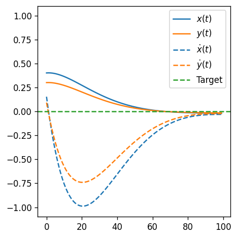
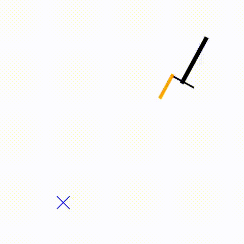
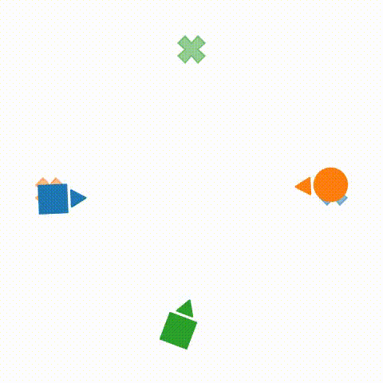
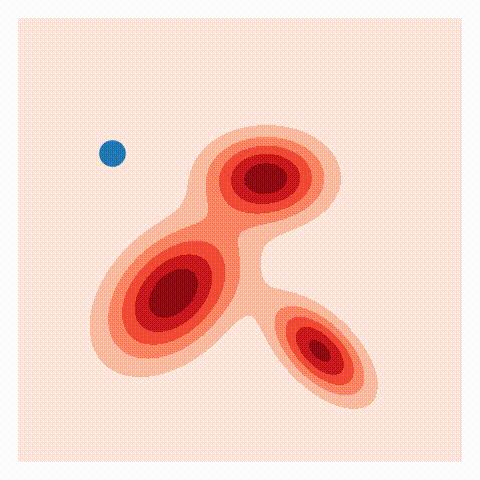

<div align="center">
</img>
</div>

# LQRax
**LQRax is a GPU-friendly, auto-differentiable solver for continuous-time LQR problems based on Riccati equations, enabled by [JAX](https://github.com/jax-ml/jax).**

- It accelerates numerical simulation through JAX's [`scan`](https://docs.jax.dev/en/latest/_autosummary/jax.lax.scan.html) mechanism;
- It enables rapid prototyping of single-agent and multi-agent nonlinear control algorithms, with [auto-differentiation](https://docs.jax.dev/en/latest/automatic-differentiation.html) support on the loss function and dynamics;
- It enables batch-based large-scale optimal control on GPUs using JAX's [`vmap`](https://docs.jax.dev/en/latest/_autosummary/jax.vmap.html) mechanism.
- All the operations, including trajectory simulation and control synthesis, are backward-differentiable.

*This repo is currently under active development.*

## Examples

| *Example* | *Code* | *Example* | *Code* |
| :---: | :---: | :---: | :---: |
| **LQR Basics** <br>  | [[Notebook]](examples/lqr_example.ipynb) <br> [[Google Colab]](https://colab.research.google.com/github/MaxMSun/lqrax/blob/main/examples/lqr_example.ipynb) | **Nonlinear control** <br>  | [[Notebook]](examples/ilqr_example.ipynb) <br> [[Google Colab]](https://colab.research.google.com/github/MaxMSun/lqrax/blob/main/examples/ilqr_example.ipynb) |
| **Multi-agent iLQGames** <br>  | [[Notebook]](examples/ilqgames_example.ipynb) <br> [[Google Colab]](https://colab.research.google.com/github/MaxMSun/lqrax/blob/main/examples/ilqgames_example.ipynb) | **Ergodic control** <br>  | [[Notebook]](examples/ergctrl_example.ipynb) <br> [[Google Colab]](https://colab.research.google.com/github/MaxMSun/lqrax/blob/main/examples/ergctrl_example.ipynb) <br> [[More]](https://github.com/MurpheyLab/ergodic-control-sandbox) |

Please also checkout [Linear Quadratic Flow Matching](https://murpheylab.github.io/lqr-flow-matching/) that uses this package.

## Install

Follow the [instructions](https://github.com/jax-ml/jax?tab=readme-ov-file#installation) to install JAX before installing this package.

To install: `pip install lqrax`

## Usage

There are two modules: `LQR` and `iLQR`,

The `LQR` module solves the following time-varying LQR problem:

$$
\arg\min_{u(t)} \int_0^T \Big[ (x(t)-x_{ref}(t))^\top Q (x(t)-x_{ref}(t)) + u(t)^\top R u(t) \Big] dt
$$
$$
\text{s.t. } \dot{x}(t) = A(t) x(t) + B(t) u(t), \quad x(0) = x_0
$$

The `iLQR` module solves a different time-varying LQR problem:

$$
\arg\min_{v(t)} \int_0^T \Big[ z(t)^\top Q z(t) + v(t)^\top R v(t) + z(t)^\top a(t) + v(t)^\top b(t) \Big] dt
$$
$$
\text{s.t. } \dot{z}(t) = A(t) z(t) + B(t) v(t), \quad z(0) = 0.
$$

This formulation is often used as the sub-problem for iterative linear quadratic regulator (iLQR) to calculate the steepest descent direction on the control for a general nonlinear control problem:

$$
\arg\min_{u(t)} \int_0^T l(x(t), u(t)) dt, \text{ s.t. } \dot{x}(t) = f(x(t), u(t)),
$$ 

where the $z(t)$ and $v(t)$ are perturbations on the system's state $x(t)$ and control $u(t)$, and $A(t)$ and $B(t)$ are the linearized system dynamics $f(x(t), u(t))$ on the current system trajectory with respect to the state and control. 

## Copyright and License

The implementations contained herein are copyright (C) 2024 - 2025 by Max Muchen Sun, and are distributed under the terms of the GNU General Public License (GPL) version 3 (or later). Please see the LICENSE for more information.

If you use the package in your research, please cite this repository. You can see the citation information at the right side panel under "About". The BibTeX file is attached below:
```
@software{sun_lqrax_2025,
    author = {["Sun"], Max Muchen},
    license = {GPL-3.0},
    month = march,
    title = {{LQRax: JAX-enabled continuous-time LQR solver}},
    url = {https://github.com/MaxMSun/lqrax},
    version = {0.0.6},
    year = {2025}
}
```

Contact: msun@u.northwestern.edu
